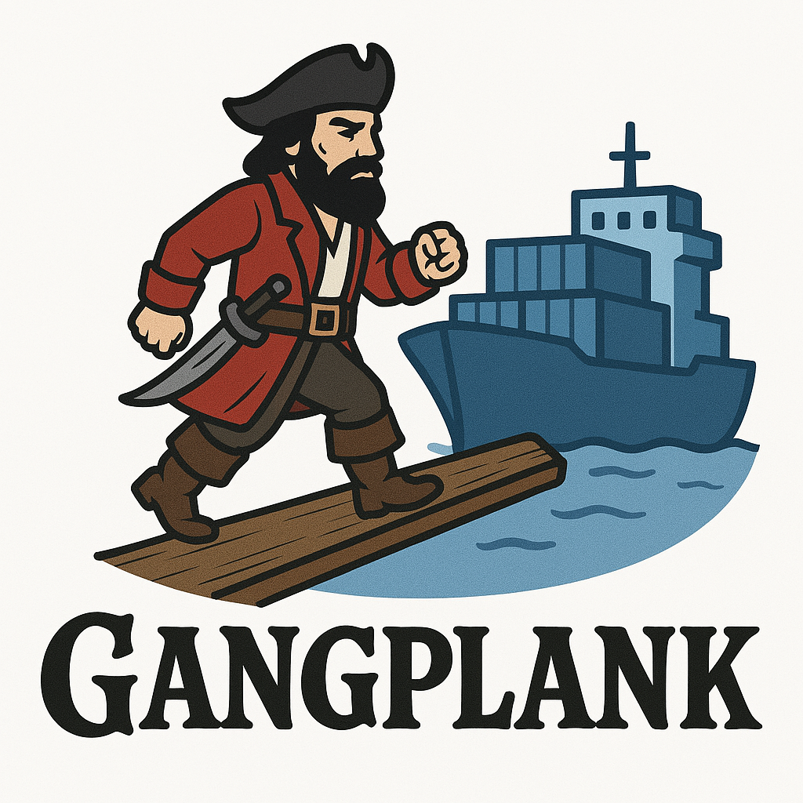

# Gangplank

Gangplank is a CLI tool to manage UPnP port mappings, designed with Docker in mind. 
It automatically grabs port mappings from running Docker containers or YAML files and forwards them to your router via UPnP, making it a perfect fit for homelabs and self-hosted environments. 

Whether you’re running media servers, game servers, or development setups behind a NAT, Gangplank simplifies exposing services to your local network or WAN.

> **Gangplank** - (nautical) A movable board used to board or disembark from a ship, bridging the gap between vessel and shore

## Why Gangplank?

- **Dynamic Environments**: Docker containers start and stop, and Gangplank keeps ports in sync.
- **Ease of Use**: No need to log into your router’s admin page—Gangplank does it via UPnP.
- **Self-Hosted Accessibility**: Expose services like Plex, Nextcloud, or game servers to friends or the internet without static IPs or complex NAT rules.

## Getting started

Gangplank is distributed as a Docker image, ideal for homelabbers and self-hosters using Docker.

### Prerequisites

- Docker installed on your system.
- A UPnP-enabled router.

### Running Gangplank

Pull the image:
```bash
docker pull ionbazan/gangplank:latest
```

Run Gangplank as a daemon (default mode):

```bash
docker run -d --network host \
    --restart unless-stopped \
    -v /var/run/docker.sock:/var/run/docker.sock:ro \
    ionbazan/gangplank:latest
```

or add it to your `docker-compose.yml`:

```yaml
services:
  gangplank:
    image: ionbazan/gangplank
    network_mode: host
    volumes:
      - /var/run/docker.sock:/var/run/docker.sock:ro
    restart: unless-stopped
```

## Usage examples

You can find more usage examples in the [usage documentation](doc/usage.md).

## Advanced usage

For advanced usage, including command-line options and environment variables, check out the [advanced usage documentation](doc/advanced.md).

## Features
- Fetch port mappings from Docker containers or YAML files.
- Forward ports via UPnP to your router.
- Poll Docker events to dynamically add/remove mappings (`daemon --poll`).
- Periodically refresh mappings to prevent expiration (`daemon` with `--refresh-interval`).
- Manually add or delete individual port mappings.


## Notes

- Gangplank uses a 1-hour lease duration for UPnP mappings by default. In `daemon` mode, `--refresh-interval` (default 15m) renews them before expiration.
- Use `--network host` for UPnP to reach your router; Docker’s bridge network won’t work for homelab NAT traversal.

## Contributing

Open issues or PRs on [GitHub](https://github.com/ionbazan/gangplank)!

## License

MIT

## Similar Projects

There are existing projects that provide similar functionality, but they are either outdated or not actively maintained. 
Gangplank aims to fill this gap with a modern, Docker-centric approach to UPnP port mapping.

- https://github.com/danielbodart/portical
- https://github.com/ProjectInitiative/upnp-service

