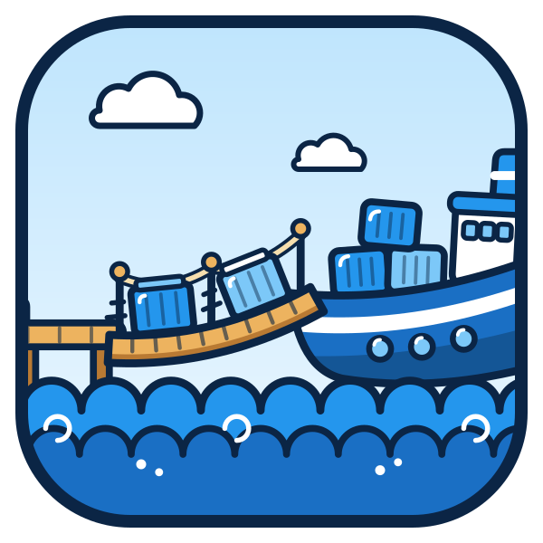

<p align="center"></p>

# Gangplank

[](https://github.com/IonBazan/gangplank/actions/workflows/ci.yml)
[](https://github.com/IonBazan/gangplank/releases)
[](https://hub.docker.com/r/ionbazan/gangplank)

Gangplank opens ports on your router for your Docker containers.
Add a label to a container and Gangplank asks your router, over UPnP, to forward its ports.
When the container stops, the ports can be closed again.

It is made for homelabs and self-hosted setups: media servers, game servers, Nextcloud and anything else you want to reach from outside your home network.

> **Gangplank** (nautical): a movable board used to get on or off a ship, bridging the gap between ship and shore.

## Why Gangplank?

- **No router admin pages.** Gangplank talks to your router for you.
- **Follows your containers.** Ports are opened when containers start and refreshed while they run.
- **Simple setup.** One container with access to the Docker socket, and labels on the services you want to expose.

## Getting started

You need:

- Docker
- A router with UPnP enabled

Run Gangplank as a daemon:

```bash
docker run -d --network host \
    --restart unless-stopped \
    -v /var/run/docker.sock:/var/run/docker.sock:ro \
    ionbazan/gangplank:latest
```

Or with Docker Compose:

```yaml
services:
  gangplank:
    image: ionbazan/gangplank
    network_mode: host
    volumes:
      - /var/run/docker.sock:/var/run/docker.sock:ro
    restart: unless-stopped
```

Gangplank must use the host network. Otherwise it can't find your router.

If you don't use Docker, download a binary for Linux, macOS, Windows or FreeBSD from the [releases page](https://github.com/IonBazan/gangplank/releases).

## Usage

Add the `gangplank.forward` label to a container. With `published`, every port the container publishes on the host is forwarded on the same port number:

```yaml
services:
  nginx:
    image: nginx
    ports:
      - "80:80"
      - "443:443"
    labels:
      gangplank.forward: "published"
```

You can also pick specific ports, forward a container port that Docker published on a random host port, or list ports for services outside Docker in a YAML file.
See the [usage guide](doc/usage.md) for examples.

All options, environment variables and commands are described in the [advanced guide](doc/advanced.md).

## Features

- Reads ports from container labels and from a YAML file.
- Opens ports as soon as containers start (`daemon --poll`) and can close them when they stop (`--cleanup-on-stop`).
- Renews mappings before they expire (`--refresh-interval`).
- Can remove leftover mappings (`--prune`) and clean up when it shuts down (`--cleanup-on-exit`).
- Keeps working when Docker restarts or the router is not ready yet.
- Commands to list, add and delete single mappings.

## Good to know

- Mappings are created with a 1 hour lease by default. The daemon renews them every 15 minutes.
- Access to the Docker socket is the same as root access on the host. The [security notes](doc/advanced.md#security) show how to use a socket proxy instead.
- Every port you label can be reached from the internet. Only expose what you mean to.

## Contributing

Issues and pull requests are welcome on [GitHub](https://github.com/IonBazan/gangplank).

Before sending a pull request, run:

```bash
go test -race ./...
golangci-lint run ./...
```

### Releasing

Push a tag like `v1.2.3`. CI then:

- publishes Docker images for all supported platforms to Docker Hub and GHCR,
- creates a GitHub release with binaries, checksums and a changelog (using [GoReleaser](https://goreleaser.com)).

Forks work the same way. Images go to `ghcr.io/<owner>/<repo>`. To also push to Docker Hub, add a `DOCKERHUB_PASSWORD` secret. The image name defaults to `<owner>/<repo>`; set the `DOCKERHUB_USERNAME` or `DOCKERHUB_REPOSITORY` repository variables to change it.

## License

MIT

## Similar projects

- [Portical](https://github.com/danielbodart/portical)
- [upnp-service](https://github.com/ProjectInitiative/upnp-service)
